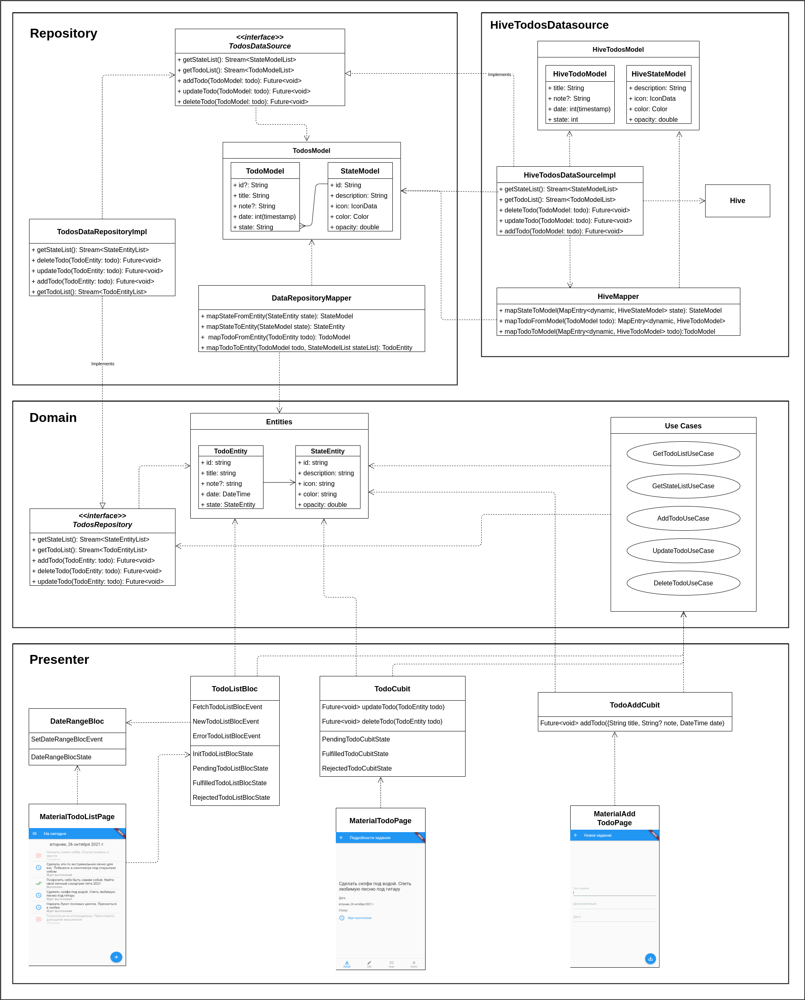

# Flutter Todos

Это учебная задача есть попытка познакомится с flutter и разобраться в паттерне "Чистая архитектура" (далее для краткости ЧА).

#### Архитектура приложения с точки зрения зависимостей

#### На чем и как сделано

- Получился изрядный overengineering со смесью разных технологий/пакетов, но такова и была основная цель задания.

- [flutter_hooks](https://pub.dev/packages/flutter_hooks). По сравнению с StatefulWidget количество строк уменьшается по моим прикидкам раза в три. Все очень просто, логично и лаконично, если знаком с react конечно :smile:.

- [styled_widget](https://pub.dev/packages/styled_widget). Изрядно уменьшает количество кода.

- [auto_route](https://pub.dev/packages/auto_route). Это совсем избыточно, достаточно было бы использовать и navigation 1.0 onGenerateRoute, подходящий и для куда более серьезных задач. Если для полноценной поддержки web разве что.

- Service Locator [get_it](https://pub.dev/packages/get_it) для DI.

- [hive_flutter](https://pub.dev/packages/hive_flutter) для имитации бэка.

- Для имитации работы с бэком запросы на запись (insert, update, delete) выполняются с задержкой и примерно 30% случайно заканчиваются ошибкой.

#### Чего нет и что вышло за рамки

- Бизнес, UI/UX аналитики. Страницы и компоненты собраны в кучу с таким расчетом, чтобы хоть как то быть похожими на реальное приложение. Собственно, это задача для проф дизайнеров и аналитиков, а не разработчика. Ну, по крайней мере так должно быть.

- Своего набора Exceptions с продуманной текстовкой ошибок.

- Интересный вопрос: а как, собственно, инициализировать приложение? Не всякие там singlton, а действия имеющие возможность закончится ошибкой. Судя по логике ЧА должна быть некая псевдокнопка "InitApplication" на уровне UI. При запуске приложения пользователь неявно ее нажимает и происходит загрузка первоначальных данных с бэка, проверка auth, подключение к firebase, геолокация и.т.д. В этом случае появляется возможность отработать ошибку, и показать кнопку типа "Ошибка такая та! Повторить?".

#### Как резюме

Паттерн ЧА - это для больших монолитных приложений. Глобально охватывает все, от кнопки на экране до таблицы БД. Современные же веб и мобильные приложения по большей части четко разделяются на две части: front и back. Back реализует "бизнес правила предприятия", хранит данные и вообще является мозгом. А задача front - только взаимодействие с пользователем.

В итоге получается, применительно к flutter и не только:

- Слой entity вырождается в анемичную модель. Просто набор классов с описанием данных.

- Слои презентеров и сценариев вполне можно объединить в один и реализовать с помощью паттернов bloc/cubit, provider. Если совсем все просто, то StatefulWidget достаточно будет. Вешать на каждую кнопочку свой контроллер уже явный перебор.

- Часть внешнего слоя repository (в оригинале от дяди Боба его нет) получается больше похожа на интерфейс с back(REST, GraphQL). Или нечто совсем простое для постоянного хранения данных типа noSQL hive, shared preferences, sqflite.

Все адепты ЧА утверждают, что наличие четырех слоев не является догмой. Самое главное, что бы соблюдалось правило зависимостей.

#### Thanks

- https://github.com/LostInIreland/Flutter-Clean-Architecture. Наиболее подробный из всех встреченных в инете разбор ЧА с детальной схемой. Я только не понял, зачем в слое data группа элементов: DataStoreFactory, DataStoreInterface, DataStoreImplementation. Что они делают понятно, но какая от них практическая польза, т.е. в каких случаях оправдано их использование?

- https://github.com/devmuaz/flutter_clean_architecture

- https://github.com/surfstudio/flutter-surf-lint-rules

- [Заблуждения Clean Architecture](https://habr.com/ru/company/mobileup/blog/335382/)
